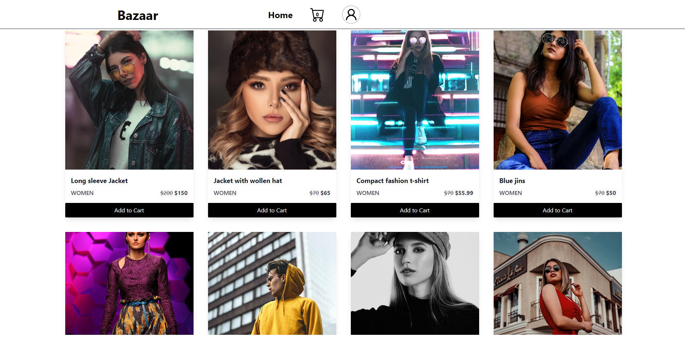
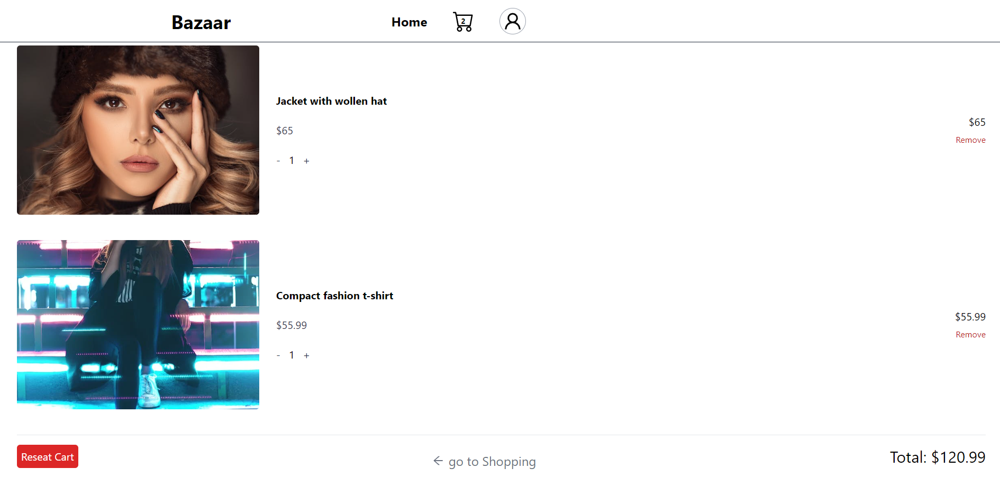

# Bazaar - An Ecommerce App

Bazaar is an ecommerce app built with React, Tailwind CSS, Redux Toolkit, React Toastify, Firebase, Redux Persist and React Icons.

## Getting Started

To run this application, you'll need to have Node.js and npm installed on your machine. You can then clone this repository and run the following commands:

```
 npm install
 npm start
```
This will start the application in development mode. You can then open http://localhost:3000 to view it in the browser.

## Features

This an e-commerce includes the following features:
- Product listing page to display all products
- Product detail page to show details of each product
- Cart management - Add/remove products to cart, view cart items
- User authentication using Firebase - Users can sign in with Google
- Redux Persist to persist cart data even after page refresh

## Technologies Used
This project was built using the following technologies:

- React (Hooks, Router)
- Tailwind CSS
- Redux Toolkit for state management
- React Toastify for notifications
- Firebase for user authentication
- Redux Persist to persist Redux store
- React Icons
## Screenshots




## Future Scope
- Add payment integration
- Add user profile page
- Improve styling using a UI library
- Add product ratings and reviews
- Improve Redux implementation

## Acknowledgements
- Tailwind CSS documentation
- Redux Toolkit documentation
- React Router documentation
- Firebase authentication documentation

## 🚀 About Me
Mohamed Khaled is a skilled front-end developer specializing in React JS and is passionate about creating responsive and dynamic user interfaces. With a strong background in web development and a wealth of experience working on a range of projects, I bring a proven track record of delivering high-quality work and exceeding client expectations.

Throughout my career, I have honed my skills in various areas, including React JS, JavaScript, HTML, CSS, and other web development technologies. I pride myself on my ability to create intuitive, user-friendly designs that prioritize the user experience and seamlessly integrate with backend systems.

Some of the technologies and tools I'm proficient in include:

- React JS (including Redux Toolkit, React Router, and Next.js)
- JavaScript (ES6+) and TypeScript
- HTML5, CSS3 (including CSS preprocessors such as Tailwind CSS)
- Responsive web design and mobile-first development
- Git and GitHub
- Testing frameworks such as Jest

My portfolio includes several notable projects demonstrating my technical expertise and creative problem-solving abilities. Whether working independently or as part of a team, I am committed to delivering results that meet or exceed client expectations, on time and within budget.

If you are looking for a skilled front-end developer with expertise in React JS, look no further. Contact me today to discuss your project and discover how I can help bring your vision to life.


## 🔗 Links
[](https://www.linkedin.com/in/mohamed-developer/)
